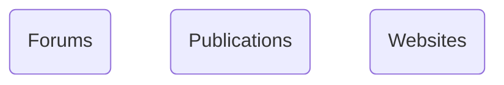
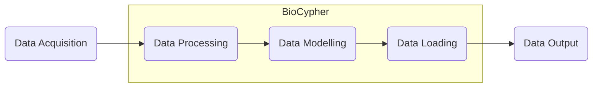

# Knowledge Graph Resources Online
A collection of useful knowledge graph resources available online

## Data Acquisition

## Data Processing
- https://github.com/TranslatorSRI/NodeNormalization

## Data Modelling
- https://pypi.org/project/biolink-model/
- https://github.com/linkml/linkml

## Data Loading
- https://github.com/biolink/kgx/
- https://github.com/knowledge-Graph-Hub/
- https://github.com/Knowledge-Graph-Hub/kg-template

## Data Output
