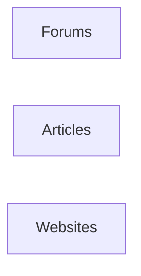
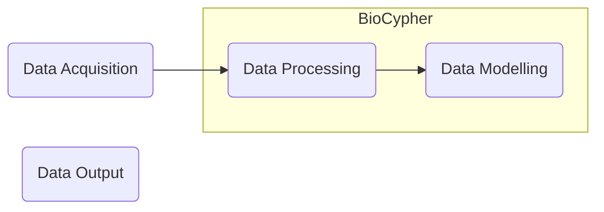

# Knowledge Graph Resources Online
A collection of useful knowledge graph resources available online

```mermaid
  graph LR; 
      Forums;
      Articles;
      Websites;
```

```mermaid
  graph LR; 
      DA(Data Acquisition)-->DP(Data Processing);
      subgraph BioCypher
        DP-->DM(Data Modelling);
      end
     DO(Data Output);
```
